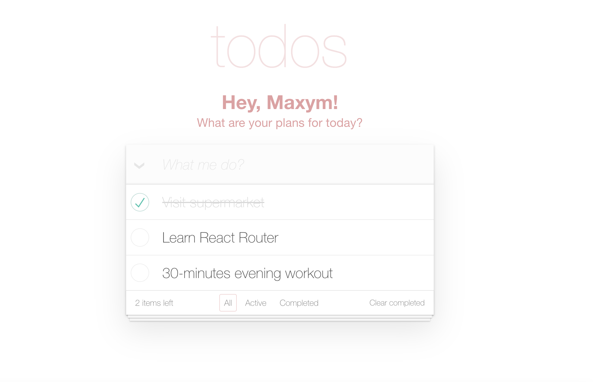

# React Todo-App with API
This is a basic todo-app built on React with API, HTML/CSS, where you can plan you staf for the day:
- Login using your email;
- Add / edit / delete todos;
- Set tasks bulk completed and bulk deleted;

Looks like this:

To use the app visit the [DEMO LINK](https://max-kravchenko.github.io/todo-app/)
